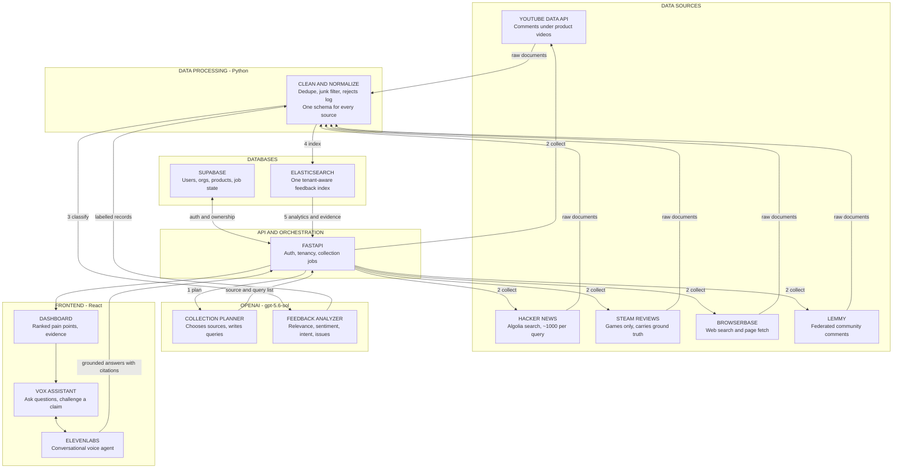

# Overheard

**Turn scattered public feedback into ranked, evidence-backed product decisions.**

Point it at a product name. It finds what people are actually saying across five
platforms, throws away the noise, works out what they mean, and shows you ranked
pain points — each backed by real quotes you can click through to the original.
Then you can ask it questions out loud.

---

## The problem

A product manager wants to know what customers really think. Today that means
either reading scattered comments by hand for a week, or paying for a tool that
scrapes one platform and hands back a sentiment score with no receipts.

A number nobody can trace is not a decision. **Evidence is the product.**

## What makes it different

**It reads, it does not keyword-match.** "I love how it deletes my data" is
negative. "This thing is sick" is praise. A lexicon gets both backwards.

**It knows what is not about your product.** Collecting "Notion" from YouTube
returns comments about a *song* called Notion. Those get rejected, along with
"first!!" and "great video man" — comments about the video rather than the
product. That noise was most of what the dashboard used to show.

**It refuses to pool incomparable sources.** On one product, YouTube's top
engagement scores were 8843/8288/7453 while Steam's were 4/3/2. Sorting on that
number globally returned 100% YouTube and the other sources never reached the
screen. Every metric now ships with a per-source breakdown, and evidence is
balanced across sources.

**It can be checked.** Steam publishes `voted_up` — the reviewer's own verdict.
That gives a ground truth to score the analysis against, which is how we knew
the old lexicon called 55% of genuinely negative reviews positive.

---

## Architecture




A [detailed version](assets/architecture-detailed.mmd) ([image](assets/D2.png))
shows every component, with planned-but-unbuilt pieces drawn dashed. The
[collection sequence](assets/collection-flow.mmd) ([image](assets/D3.png))
walks through a single run.

### Exactly two model calls per run

One to **plan** (which sources, what queries) and one to **classify** (in
batches of 10). Everything in between is ordinary retrieval, deduplication and
aggregation. Remove the model and the pipeline still runs — it just picks worse
queries and classifies worse.

### Three stores, on purpose

| Store | Holds | Why separate |
|---|---|---|
| **Supabase** | users, orgs, products, job state | Needs transactions, foreign keys, row-level security |
| **Elasticsearch** | the feedback corpus, all analytics | Needs full-text search and aggregations at scale |
| **OpenAI** | nothing | Stateless; never a dependency for reads |

---

## Quick start

### Prerequisites

| | Version | Notes |
|---|---|---|
| Python | 3.11+ | |
| Node | **20.19+ or 22+** | Vite 8 will not start on older Node |
| Elasticsearch | 8.15+ | Elastic Cloud free trial works |
| Supabase | — | Free tier works |

### 1. Install

```bash
git clone https://github.com/tyseer2335/HTN2026.git
cd HTN2026

pip install -e ".[dev,browserbase]"

cd frontend && npm install && cd ..
```

> **Windows PowerShell:** if `npm` is blocked by the execution policy, use
> `npm.cmd install`, or run `Set-ExecutionPolicy -Scope CurrentUser RemoteSigned`
> once. Git Bash avoids the issue entirely.

### 2. Configure

```bash
cp .env.example .env
```

Fill in `.env`. **It must be named exactly `.env`** — Notepad silently saves
`.env.txt`, which will not load. Nothing is read from `.env.example`; that file
is only a template.

#### Required

| Variable | Where to get it |
|---|---|
| `OPENAI_API_KEY` | [platform.openai.com](https://platform.openai.com/api-keys) — planning + analysis |
| `YOUTUBE_API_KEY` | Google Cloud Console → enable **YouTube Data API v3** → create API key (free) |
| `ELASTIC_CLOUD_ID` + `ELASTIC_API_KEY` | Elastic Cloud deployment. Use `ELASTICSEARCH_URL` instead for self-hosted |
| `SUPABASE_URL`<br>`SUPABASE_PUBLISHABLE_KEY`<br>`SUPABASE_SECRET_KEY` | Supabase → Project Settings → API. Publishable is the **anon** key, secret is **service_role** |

#### Optional

| Variable | Effect if unset |
|---|---|
| `BROWSERBASE_API_KEY` + `BROWSERBASE_PROJECT_ID` | Browserbase source is skipped |
| `ELEVENLABS_*`, `PUBLIC_BASE_URL` | Voice agent disabled, everything else works |
| `AUTHOR_HASH_SALT` | Uses a dev default. **Set this in production** |
| `LLM_ANALYSIS_BATCH` (default 10)<br>`LLM_ANALYSIS_WORKERS` (default 12) | Analysis throughput. Lower workers if you hit 429s |

A source without credentials is **skipped and reported**, never fatal. You can
run the whole system with only `OPENAI_API_KEY` and get Hacker News and Lemmy.

### 3. Initialize Supabase

In the Supabase SQL Editor, run:

```
supabase/migrations/202609190001_initial_tenant_schema.sql
```

This creates `organizations`, `organization_members`, `products` and
`ingestion_jobs` with row-level security.

### 4. Run

```bash
# terminal 1 - backend on port 8000 (the Vite proxy expects this port)
PYTHONPATH=src python -m uvicorn product_voice.api:app --reload --port 8000

# terminal 2 - frontend
cd frontend && npm run dev
```

Open **http://localhost:3000**, sign up, create a workspace and a product, then
click **Collect feedback**.

> Settings are cached at startup. **Any `.env` change needs a backend restart.**

---

## Voice agent (optional)

The Vox panel works without ElevenLabs — it just will not speak. To enable it,
note that the agent's tools are **webhooks ElevenLabs calls from its own
servers**, so your machine must be reachable from the internet.

```bash
# 1. expose port 8000 publicly
cloudflared tunnel --url http://localhost:8000     # or: ngrok http 8000

# 2. in .env
ELEVENLABS_API_KEY=sk_...
ELEVENLABS_TOOL_SECRET=any-random-string-you-invent
PUBLIC_BASE_URL=https://<your-tunnel-url>

# 3. create an agent in the ElevenLabs dashboard, put its id in
ELEVENLABS_AGENT_ID=agent_...

# 4. register the tools against your public URL
PYTHONPATH=src python scripts/setup_voice_agent.py

# 5. restart the backend
```

Verify with `curl localhost:8000/voice/config` — it should report
`{"configured": true}`.

> **The tunnel URL is baked into the agent.** Quick tunnels get a new random URL
> on every restart. If the tunnel restarts, update `PUBLIC_BASE_URL`, re-run the
> setup script, and restart the backend — otherwise the agent still talks but
> its tools 404 silently, and it answers from imagination instead of your data.

---

## Command line

The pipeline runs without the web app, which is useful for building a corpus
before a demo.

```bash
# collect to JSONL, no Elastic or Supabase needed
python -m product_voice.collect_cli "Cyberpunk 2077" --plan --limit 400

# look at what came back
python -m product_voice.inspect_cli cyberpunk-2077.jsonl --complaints
python -m product_voice.inspect_cli cyberpunk-2077.jsonl --rejects

# collect, analyze and index in one pass
python -m product_voice.index_cli "Cyberpunk 2077" --plan --org acme --product-id cp2077

# read it back
python -m product_voice.index_cli "Cyberpunk 2077" --analytics --org acme --product-id cp2077
```

---

## Sources

| Source | Needs | Volume | Notes |
|---|---|---|---|
| `hackernews` | nothing | ~1000/query | Most reliable. Weak for consumer goods |
| `youtube` | `YOUTUBE_API_KEY` | high | Video titles screened against the product first |
| `browserbase` | `BROWSERBASE_API_KEY` | moderate | Review sites, forums, Reddit aggregators |
| `steam` | nothing | **enormous** | Games only. 1.5M reviews on a large title |
| `lemmy` | nothing | low | Federated Reddit-alike, real community voice |

### Platforms that cannot be collected

Tested directly, including through residential proxies:

| Platform | Result |
|---|---|
| Reddit | 403; with proxies HTTP 200 but the body is a "Prove your humanity" CAPTCHA |
| X / Twitter | syndication endpoint returns 429 **even proxied** |
| Instagram | embed returns 200 but carries no caption text |
| Bluesky | public search now 403s |

These are login and bot walls, not IP blocks, so no proxy fixes them. Reddit and
X *opinion* still reaches the corpus through aggregator pages that quote those
threads, which is what the Browserbase connector collects.

---

## How the data is stored

Every connector normalizes to one shape before anything downstream sees it:

```
organization_id  product_id  source  external_id  content  content_type
published_at  author_hash  engagement  language  url  source_metadata
ingested_at
+ sentiment  sentiment_score  is_complaint  issue_categories  relevant
```

**One shared index**, filtered by `organization_id` / `product_id` / `source` —
not one index per product, which would explode shard counts and make
cross-product analytics impossible.

**Duplicates are prevented structurally.** The Elasticsearch `_id` is a hash of
(org, product, source, external_id), so re-ingesting overwrites rather than
duplicates and a crashed job can safely replay. Verified: indexing the same
2,146 documents twice leaves 2,146 documents.

**Usernames are never stored.** `author_hash` is a salted, source-scoped digest
— enough to count distinct voices and spot one person posting fifty times,
without retaining who they are.

---

## Failure behaviour

A partial result beats no result. Losing a real complaint is worse than showing
a questionable row, which is why unknown relevance stays visible.

| Failure | Response |
|---|---|
| Missing API key | Source skipped and reported in the UI |
| Model unreachable | Falls back to lexicon scoring, relevance left unknown |
| Browserbase quota exhausted (402) | Falls back to direct HTTP for the rest of the run |
| One source crashes | Logged, the others continue |
| Elasticsearch 429/503 | Exponential backoff, 3 retries |
| Job crashes | `ingestion_jobs` row marked failed with the error |

---

## Tests

```bash
PYTHONPATH=src python -m pytest tests/ -q
```

61 tests, no network calls. Includes wiring tests that assert the modules fit
together — added after a type mismatch between the analyzer and the enrichment
layer shipped a 500 that every unit test passed straight through.

---

## Known limits

Worth saying plainly rather than discovering live:

- **A standard collection takes around two minutes.** Pre-collect before a demo.
- **No vector search.** Elasticsearch is BM25 keyword only. Hybrid retrieval is
  the obvious next step, not something already present.
- **Steam only applies to games.**
- **Analysis runs at roughly 9 comments/second**, tunable via batch size and
  worker count.
- **Background topic clustering, trend detection and a recurring scheduler are
  designed but not built.** They appear dashed on the detailed diagram.
- **`bridge.py` is dead code** from the original YouTube-only schema.

---

## Project layout

```
src/product_voice/
  api.py              FastAPI app, 9 routes (+6 under /voice)
  planner.py          LLM picks sources and writes queries
  collect.py          Orchestration, dedupe, junk filter, rejects log
  collect_service.py  Depth presets, ties the stages together
  llm_analysis.py     Batched LLM classification
  enrich.py           Applies analysis, lexicon fallback
  feedback.py         The normalized record
  feedback_store.py   Elastic mapping, indexing, balanced search, analytics
  voice.py            Voice endpoints and grounded agent tools
  supabase.py         REST client
  sources/            One adapter per platform
frontend/             React + Vite dashboard
scripts/              Voice agent provisioning
supabase/migrations/  Tenant schema
assets/               Architecture diagrams
tests/                61 tests
```
